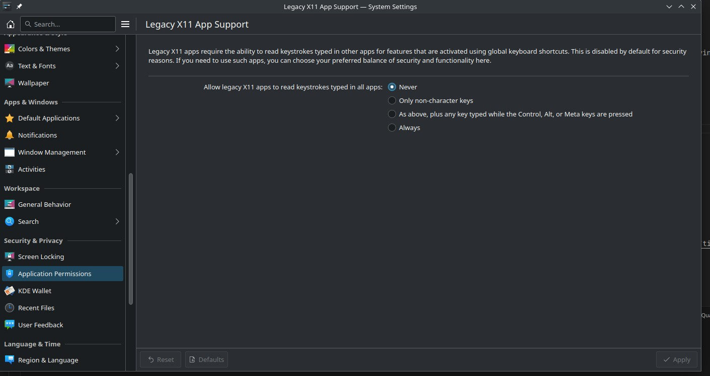
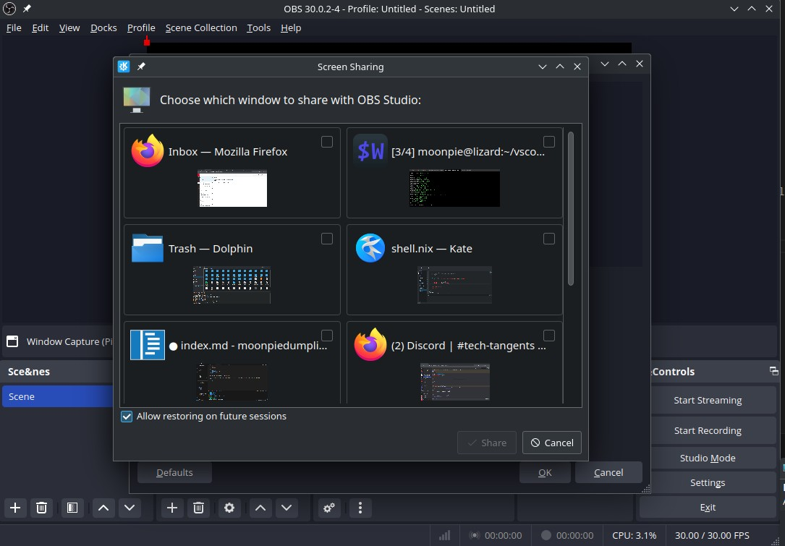
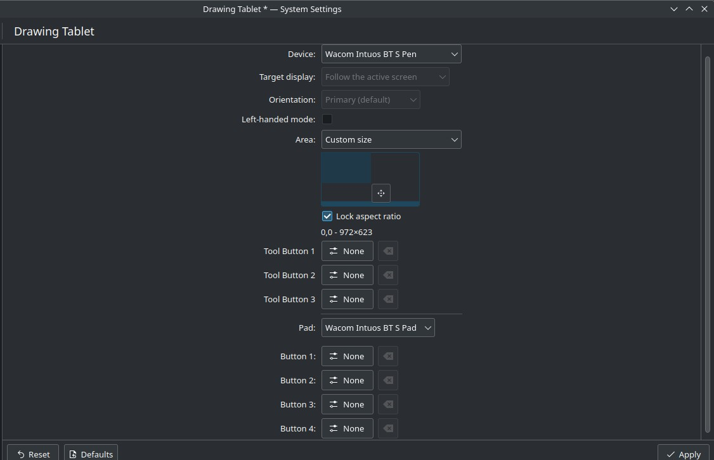

KDE 6 is released, and it comes with quite a few new features. 


# Smoothing out the Wayland migration

In addition to the other things mentioned, KDE 6 also comes with some new security and privacy features. 



KDE 6 now adds a new settings panel where users can configure if X11 apps can read global inputs. 

For context, the Linux desktop used to be built on top of this software called [X11](https://en.wikipedia.org/wiki/X_Window_System). X11 worked, but it had some pretty severe flaws, the two main one's being code rot, and security. 

Code rot is self explanatory. X11 was first built in 1984. It's been a while since it was made, and it has a lot of old code. The project is so big and complex, that it's nearly impossible to add significant features to it.

The other problem is security. By default, X11 lets running apps have basically absolute control over the other graphical interface. They can "view" the whole screen, read all keypresses, and insert, or modify keypresses. 

[Wayland](https://en.wikipedia.org/wiki/Wayland_(protocol)), is the newer replacement, although it is technically just a protocol, a definition, as opposed to an actual piece of software. Different pieces of software choose to implement this protocol, with KDE being one of them. 

One of the issues people have with Wayland, is that, by design, it doesn't allow all apps to read everything on the screen. This breaks things like screen sharing, with native Discord (although sharing your screen to Discord running in Firefox works). 

It also breaks push-to-talk on Discord, since that uses a global hotkey. The above setting allows users to temporarily restore that functionality, at the cost of desktop security. , since Discord hasn't developed it for native wayland yet. 


Another issue people have with Wayland is problems with Nvidia. Due to Nvidia's insistence on proprietary drivers and their own standards, it's been very difficult ot get Wayland support on Nvidia. However, KDE comes with some big changes as, I can finally use Nvidia + Wayland on my larger laptop!


# OBS

One features I've been waiting on, which I think will only end up coming in Wayland, is the ability to share some windows, but not all. I experimented with some of the new features of OBS, but they don't do quite what I want. 

For example, with OBS and pipewire, I noticed I can select multiple windows from the "Window Share" source:




Except it doesn't actually work. Instead, it just puts one of the windows on top, and none of the others. 


I tried an alternative to this:


But it doesn't do quite what I want. It creates a literal virtual monitor, including the ability to change settings to things like "unify outputs", or "extend outputs".


What I really want is the ability to share only a single [kde workspace](https://kde.org/announcements/4/4.5.0/plasma/).

OBS had an option to share a KDE plasma workspace, but it doesn't work like what I want. Instead of just sharing a single workspace, it turns all monitors into a single input source. If I switch workspaces, then the screen video switches as well.


# Drawing Tablets


KDE 6 finally makes support for drawing tablets first class. You can now configure drawing tablets directly from the settings menu.



So all the buttons, but also another, more important feature I need: mapping the drawing tablet to a smaller portion of the screen. 

I typically take notes with [xournal++](https://xournalpp.github.io), but I struggle because my handwriting is large and sloppy, especially when I am trying to take notes more quickly. From my testing, this feature is amazing, since it makes it easier to write, and read what I've wrote afterwards. 


# Bugs

So far, I've encountered two crashes with KDE, after like a week of usage, which is pretty good from what I hear, compared to other people.

To recover from a crash, I just switch to a TTY, and/or use a terminal, and then run:

```{.default}
systemctl --user restart plasma-plasmallshell
```

This only works on systemd, however. Since Plasma-5.25, [KDE consisting of systemd user services has been the default method](https://wiki.archlinux.org/title/KDE#systemd_startup)

On non systemd distros, what I've heard works is:


```{.default}
killall plasmashell && kstart5 plasmashell
```


