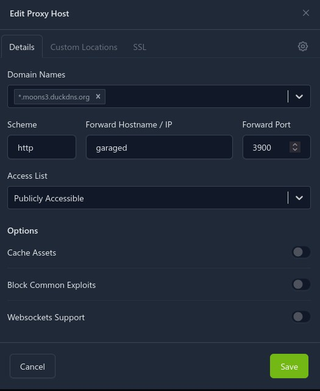
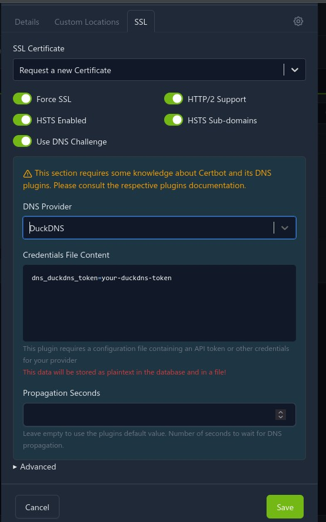

This document outlines how to deploy [garage](https://garagehq.deuxfleurs.fr/), an open source self hostable version of [Amazon S3](https://en.wikipedia.org/wiki/Amazon_S3#S3_API_and_competing_services).

Most of this guide is adapted from [the garage quick start](https://garagehq.deuxfleurs.fr/documentation/quick-start/).

Prerequisites:

* Docker
* Docker Compose (sometimes installed as `docker-compose`, sometimes as `docker compose`, both work)
* [Nginx Proxy Manager](https://nginxproxymanager.com/) (I mean, you can use another reverse proxy. But NPM is what I use here)
    * Using a [docker network](https://nginxproxymanager.com/advanced-config/#best-practice-use-a-docker-network)

Firstly, create a folder which will host the docker compose data. This folder will be called `garage` or similar. `cd` into this directory.

Below is a sample docker compose file. You may want to change the network depending on your [docker network name](https://nginxproxymanager.com/advanced-config/#best-practice-use-a-docker-network). Run the below command to create the docker compose:

```{.default}
cat > docker-compose.yaml <<EOF
version: '3'
services:
  garaged:
    image: dxflrs/garage:v2.2.0
    volumes:
      - "./garage.toml:/etc/garage.toml"
      - "./meta:/var/lib/garage/meta"
      - "./data:/var/lib/garage/data"
    container_name: garaged
networks:
  default:
    external: true
    name: mine
EOF
```

Run the below command to create the garage.toml file:

```{.default}
cat > garage.toml <<EOF
metadata_dir = "/var/lib/garage/meta"
data_dir = "/var/lib/garage/data"
db_engine = "sqlite"

replication_factor = 1

rpc_bind_addr = "[::]:3901"
rpc_public_addr = "127.0.0.1:3901"
rpc_secret = "$(openssl rand -hex 32)"

[s3_api]
s3_region = "garage"
api_bind_addr = "[::]:3900"
root_domain = ".s3.garage"

[s3_web]
bind_addr = "[::]:3902"
root_domain = ".web.garage"
index = "index.html"

[k2v_api]
api_bind_addr = "[::]:3904"

[admin]
api_bind_addr = "[::]:3903"
admin_token = "$(openssl rand -base64 32)"
metrics_token = "$(openssl rand -base64 32)"
EOF
```

Note the `$(command)`'s in the file. These are actually executed and templated, when running cat, as a form of variable substitution.

`docker-compose up -d` to start garage.


Next up is running the commands inside docker to create the "cluster" (it will only be a single node), and the bucket. Because the garage command must be ran inside the docker container, we make an alias to make it more convinient.

```{.default}
alias garage='docker exec -it garaged ./garage'

garage layout assign -z dc1 -c 1G $(garage status | tail -1 | awk '{print $1}')

garage layout apply --version 1
```

This creates the base storage pool.

Next up is bucket and key creation:

```{.default}

garage bucket create bucketname

garage key create bucketkeyname

garage bucket allow --read --write --owner bucketname --key bucketkeyname
```

Now, the reverse proxy. This is fairly simple, but you will have to use a wildcard cert, which requires a DNS-01 challenge.

In the Nginx Proxy Manager Config, new host:



And then for SSL:



Of course, some parts may change depending on your DNS provider. 


It took some fiddling, but this finally gives me Joplin sync remotely, in a secure manner (I am using Joplin e2ee).