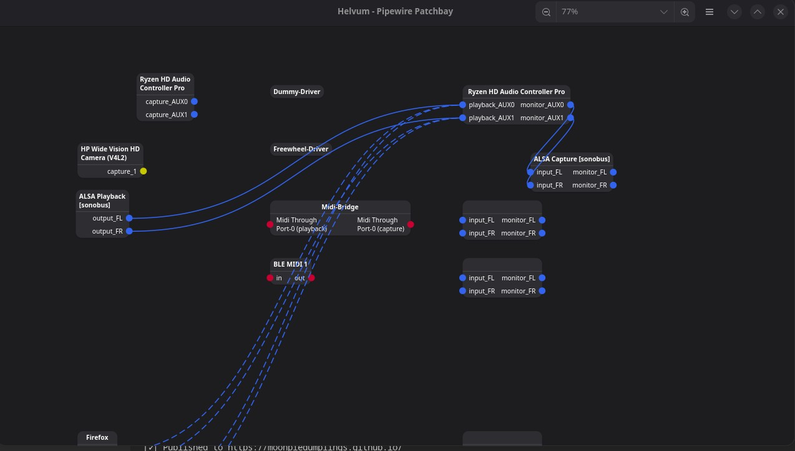

# What

I want to play audio from my computer on my phone. I want to play audio from my phone on my computer. 

This was somewhat annoying. Here I am discussing my current working and promising solutions.

# Phone to Computer

## KDE6 + Bluetooth

It used to not work. I would connect my phone to my computer via bluetooth and then nothing would happen, but I would use bluetooth tethering to create a hotspot for KDE connect. 

But with the KDE Plasma 6 update, I noticed that my phone believes my computer to be bluetooth sink. I simply connect my phone, and then it streams it's audio to my computer. 

This setup is definitely the easiest, but sadly, it's the flakiest. It will randomly die, where my phone will continue playing the music but no audio will be sent to my computer. Disconnecting and reconnecting fixes this, as does restarting the Linux bluetooth service. The frequent drops are annoying though, and seem to be a Linux issue on my end than an issue with the setup. Whenever I do something that makes CPU spike a lot I can expect a drop. I suspect this might be due to the Zen kernel or the Cachyos scheduler.

## Scrcpy

[Scrcpy](https://github.com/Genymobile/scrcpy) is an app that uses ADB to control a phone from a computer. You can view the screen of your phone and send inputs. But I am interested in the ability to send my phone's audio to my computer. 

`scrcpy --no-window` — This command launches scrcpy with no window

Unlike KDE6 + bluetooth the audio does not drop out when I do something CPU intensive.

This setup does reqiure more manual setup though, since I have to plug it in and run a command instead of pressing a few buttons. But it is my second favorite setup. It's extremely reliable, and has very low latency, although latency doesn't matter as much since I am mostly sending au

# Computer to Phone

Some of these solutions require networking the phone and the computer together. For those, I typically turn to bluetooth tethering. This shares a phone's network to a computer, but importantly, KDE/Networkmanager is smart enough to not prioritize it over the currently connected Wifi, unlike a true wifi hotspot (which disconnects me from my current Wifi), or USB tethering (which is typically prioritized over Wifi since it is considered to be ethernet). 

The main disadvantage of bluetooth tethering is that the possible network speeds are capped to the speeds of bluetooth. But this is alright, since I am just streaming audio.

My personal annoyance with bluetooth tethering is that it requires somewhere around 4 steps to set up. Pair the devices by bluetooth (since they don't connect by default), then enable bluetooth tethering in my phone settings, and then connect in my computer's network settings. But it does work.

Actually, in hindsight, bluetooth tethering is slightly more annoying since I have to ask my phone to not use my computer as a sink when I do this. 

Oh, no. It's much worse. Soundwire attempts to guess the ip address it should bind to, and it guesses wrong, meaning I can't use it. Audio share works as well but it's extremely laggy and glitchy. I think audio share is designed to work over wifi or ethernet and needs more bandwidth. Gnome audio sharing is clear and clean, but it is too laggy. 

Okay. I did more testing, and I got significant lag with actual Wifi, instead of just Wifi over bluetooth, sadly. Gnome audio is more smooth, but the 

## Soundwire

[Soundwire](https://georgielabs.net/) is what I originally used for this. Sadly, it is proprietary — it even contains ads. It also requires a network connection. It was novel and useful back when I depended on it more, but nowadays there are other apps that can play a similar role.

It does require a direct network connection though, meaning I must set up a hotspot, tethering, VPN, or similar to use it. It also requires for the relevant port on the computer to be open.

## Audio Share

[Audio share](https://github.com/mkckr0/audio-share) (yes, that is the name), is an app that does something similar to Soundwire, while being entirely FOSS and not having any ads. It also has more configuration options for tuning. 

Audio share, similar to Soundwire, requires a network conenction.

## Gnome Audio Sharing (and similar solutions)

[Gnome audio sharing](https://apps.gnome.org/AudioSharing/) is an app, and not a feature built into gnome, thankfully. It streams the audio to an RTSP stream that you can consume via a media playing app that supports it, like VLC. 

It does require a network connection, and a port open similar to the above.

There also exist similar solutions you can put together by manually manipulating the Linux audio stack to output to a network stream instead of your speakers. 

Generally, all of these solutions are inferior compared to the Audio Share app (above). It is much more clunky, the manual setup is a pain, and Gnome audio had glitches and hiccups I couldn't fix because I couldn't touch the tunables that Audio Share exposes.

There exist two benefits, although they are minimal for the price you pay:

* RTSP stream's can be played by browsers. So any device with a browser can play the stream.
* If you are setting up a network stream by configuring Linux's integrated audio stack, technically you don't need any applications on either device to make this work (assuming you have a browser)

# Unidirectional

## Sonobus

[Sonobus](https://sonobus.net/) looked really promising, since it uses NAT traversal to route audio to computers in a P2P manner. This means that I don't have to directly network the machines together.

Sadly, it seems like sonobus only shares microphone audio. `:(`. Although one trick that works is to reroute the music from the speakers to sonobus' input using a patchbay.

This works and is consisent. Sadly, there does appear to be lag in the audio, meaning that for something like watching realtime media with audio and visual components it's not really feasible. Understandable, but frustrating.

Also, there are occasionally glitches and drops, even though the overall quality is good.

This experiment shows me that it doesn't seem possible to route audio all the way over the internet (should be noted that [Sonobus does not encrypt](https://sonobus.net/sonobus_userguide.html#Introduction), which should be more performant).

# Conclusion

I should just watch twitch from my phone instead of insisting on trying to become able to watch it from my computer while simultaneous listening 

# See also

<https://wiki.archlinux.org/title/List_of_applications/Multimedia#Remote_audio>

<https://en.wikipedia.org/wiki/Comparison_of_remote_music_performance_software>

<https://nullvoxpopuli.github.io/latency-tester/> — A useful tool to test audio latency that I have found.
