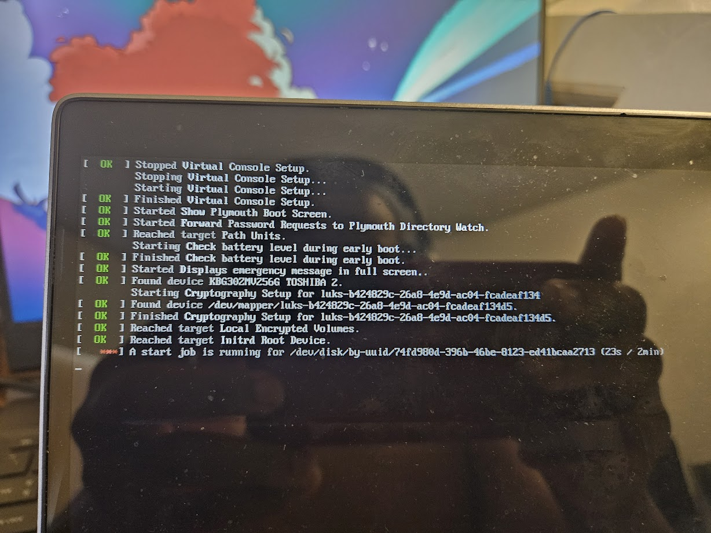

# The Re-Up

I am reinstalling CachyOS on my new framework, so I am updating this post to note what has changed and what hasn't. 


# Main Post

I've decided to reinstall [cachyos](https://cachyos.org/), the Arch Linux fork I use on my laptop's, because the config of my smaller laptop is getting crusty. In addition to not having any swap setup, `/nix` is part of the main btrfs subvolume, meaning it is included in snapshots, and my snapshots are far, far larger than they should be.

# Installation

I downloaded the latest, ISO, but I had some troubles installing. I first attempted to set up an LVM2 Partition, but that crashed, and I don't know why. The error log of the installer doesn't have any relevant information.

I tried again, but with a simpler partitioning setup, but it errored on another step, ranking the mirrors.

An excerpt from the logs of the failed install:

``` default
--> name 'arch'; mirrorlist_path '/etc/pacman.d/mirrorlist'; special_arch ''
/usr/bin/cachyos-rate-mirrors: line 97: /usr/bin/rate-mirrors: Input/output error
```

I tested the command independently, and found that it was broken. It seemed to be a bugged shell script.

In order to fix this, I decided to update just the relevant packages: `pacman -Sy cachyos-rate-mirrors rate-mirrors`. Normally, you [never want to do this](https://wiki.archlinux.org/title/System_maintenance#Partial_upgrades_are_unsupported), as it is a partial upgrade, and can cause many issues down the road. However, I don't really have a choice because the system is loaded in ram right now, and I can't do a full upgrade as I don't have enough ram to store all of those downloaded packages — especially since CachyOS comes with a full GUI.

Once the install is done, I have to set up swap, and a separate subvolume for `/nix`.

I use `arch-chroot` to chroot into the newly installed arch system, which is thankfully still mounted at `/tmp/calamares-root-ncjj4sta`.

I start by following the instructions on the arch wiki for a [btrfs swap file](https://wiki.archlinux.org/title/Btrfs#Swap_file).

I also attempted to create a subvolume for nix, but this failed. When I removed the relevant lines for the nix subvolume `/etc/fstab`, my system booted properly.

However, since hibernate wasn't working properly, I decided to set that up first.

I still had more issues.

I attempted to install using the Calamares installer, with a LVM setup, and a seperate swap "partition" on a logical volume... and calamares crashed. Apparently, [Calameres + LVM is basically completely broken](https://github.com/calamares/calamares/issues/1564)

> LVM support is broken, in fact, I have no idea why is there right now.

So yeah. 

I also attempted to play around with a systemd based initramfs. According to [the archwiki](https://wiki.archlinux.org/title/Power_management/Suspend_and_hibernate#Configure_the_initramfs)

> When an initramfs with the systemd hook is used, a resume mechanism is already provided, and no further hooks need to be added


Compared to a normal hibernate setup, you have to locate the swap partition/swapfile, and then pass it as a kernel parameter. However, systemd automatically detects a swap partition/swapfile to hibernate it. But this took me some time to get a systemd based initramfs set up properly.

The hooks are in /etc/mkinitcpio.conf must be modified as follows:

```{.default filename='/etc/mkinitcpio.conf'}
HOOKS=(base systemd autodetect microcode modconf kms keyboard sd-vconsole block sd-encrypt filesystems fsck)
```

(No resume hook is needed). 

However, this still wouldn't boot, and I couldn't figure out why. 

Figured it out: <https://wiki.archlinux.org/title/Dm-crypt/System_configuration#Using_systemd-cryptsetup-generator>

By copying `/etc/crypttab` to `/etc/crypttab.initramfs`, it will be copied over the the initramfs, enabling the systemd based initramfs to read a version of the `crypttab` configuration file stored in the initramfs. 

Although, I am left with some questions, like why the non-systemd based initramfs doesn't need this, it seems to work fine. Systemd automatically detects the swap file, even if it is stored in the encrypted btrfs partition. 

Another plus: A [new cachyos iso](https://cachyos.org/blog/2406-june-release/) was released. This iso release, fixes the issues with the mirror software being broken. 

Now that Cachyos is installed, I need to figure out how to make a top level subvolume. According to the [arch wiki article on btrfs subvolumes](https://wiki.archlinux.org/title/Btrfs#Swap_file)

> Tip: Consider creating the subvolume directly below the top-level subvolume, e.g. @swap. Then, make sure the subvolume is mounted to /swap (or any other accessible location).

Why is this setup better? And how do I create a subvoolume directly below the top level?

When I run `btrfs su create /mnt/@nix` it doesn't properly create  a subvolume. Instead, it says `top level 256 path @nix`, meaning that this subvolume is nested in the subvolume with ID 256, the @ subvolume. However, @home, @var, and @tmp aren't like that, instead they have the top level 5, meaning they are directly on the top level subvolume, which is equivalent to the filesystem itself. 

Okay, I think I figured it out. In the chroot I make, I mount the btrfs filesystem with `@` as the root subvolume, meaning any subvolumes I create are nested below that. In order to properly create a subvolume under the top, I have to mount it first. 

I still don't understand the benefit of having a subvolume under the top level subvolume, rather than another nested subvolume layout. Maybe because snapshots happen to nested subvolumes as well, and this avoids the swapfile accidentally getting snapshotted? 

I encountered another issue, after testing hibernate: 



Except... that UUID doesn't exist. There is no mention of it in /etc/fstab. Then I remembered, according to the arch wiki article for hibernation, systemd stores the location where to resume from a hibernation in `/sys/firmware/vars/efivars/HibernateLocation`.

```{.default file='/sys/firmware/vars/efivars/HibernateLocation'}
{"uuid":"74fd980d-396b-46be-8123-ed41bcaa2713","offset":2269039,"kernelVersion":"6.9.3-4-cachyos","osReleaseId":"cachyos"}
```

Now this looks good... except whatever hibernate resume was trying to happen, failed. This is probably because I reinstalled linux, after I had just hibernated it, leaving that efivar in place.  

```{.default}
[root@cachyos-x8664 efivars]# btrfs inspect-internal map-swapfile -r /swap/swapfile
2168766
```

The offset was wrong. To fix it? I just had to hibernate the system normally. Then this issue went away. 

With this, my setup is complete. But I still don't understand the benefits of non-nested subvolumes. I ended up making a [lemmy post](https://programming.dev/post/15458752) about it, but I haven't gotten any conclusive answers yet. 


# User data

I backed up my entire home directory to a tar archive using ark, the archiver tool on KDE. However, since I was backing it up to a usb thumb drive, I used [gocryptfs](https://wiki.archlinux.org/title/Gocryptfs) to encrypt the folder where the archive was stored. I encrypt sensitive data I put on my usb drives, that way, even if I lose the drive, nothing gets compromised. 


# Nix not starting on boot.


::: {.callout-note}
This fix doesn't seem to be needed anymore. I didn't encounter any issues, at least.
:::

I encountered another issue where nix does not start on boot. The problem is probably that, because /nix is a seperate btrfs subvolume, and the systemd service is a symlink to the nix service on /nix, systemd cannot locate the proper service. I need to either move the nix service so it is located on the root subvolume, or adjust the nix daemon service so it requires /nix to be mounted.

Thankfully, systemd unit files have an option for this: [RequiresMountsFor=](https://www.freedesktop.org/software/systemd/man/latest/systemd.unit.html#RequiresMountsFor=).

And to adjust the nix daemon service, I can use override, as [mentioned on stackoverflow](https://askubuntu.com/questions/659267/how-do-i-override-or-configure-systemd-services). Although, I don't like this solution. Since the original service is still a symlink, would systemd really be able to find it? 

I found a [relevant GitHub issue](https://github.com/DeterminateSystems/nix-installer/issues/416) on the on the page for the Determinate Systems Nix installer, which is what I use. Just like me, another user wants to have /nix on a seperate btrfs subvolume. Although they first did a workaround of removing the symlink, and copying the service files to /etc instead. However, one of the developers chimed in, mentioning the solution for the Steam Deck (a Linux handheld which uses btrfs), which was a systemd oneshot service that runs after nix is mounted, and then reloads all systemd services, and then restarts the nix socket. This was a lot easier to implement on my system. 

The systemd service was stored in the source code of the installer.


https://github.com/DeterminateSystems/nix-installer/blob/main/src/planner/steam_deck.rs#L270


```{.ini filename='/etc/systemd/system/ensure-symlinked-units-resolve.service'}
[Unit]
Description=Ensure Nix related units which are symlinked resolve
After=nix.mount
Requires=nix.mount
DefaultDependencies=no

[Service]
Type=oneshot
RemainAfterExit=yes
ExecStart=/usr/bin/systemctl daemon-reload
ExecStart=/usr/bin/systemctl restart --no-block nix-daemon.socket

[Install]
WantedBy=sysinit.target
```

And with this, the nix socket starts properly on boot. 


# Ripping out CachyOS BS

CachyOS makes a lot of optimizations for gamers. I am not a gamer, so they annoy me.

For example, ananicy-cpp is used to control resource usage of things on the system. But, I have found that it can severely slow, or even prevent the Lichess local browser analysis from running, so I disable it. 

```{.default}
root@nefertem ~]# systemctl disable --now ananicy-cpp.service 
Removed '/etc/systemd/system/multi-user.target.wants/ananicy-cpp.service'.
systemctl ma[root@nefertem ~]# systemctl mask ananicy-cpp.service 
Created symlink '/etc/systemd/system/ananicy-cpp.service' → '/dev/null'.
```

Another thing I do is switch to the zen kernel, which is more optimized for desktop usage:

`sudo pacman -S linux-zen linux-zen-headers`

Another thing I find annoying is the `cachy-update` script. This script is well intentioned, designed to inform users of when their system updated and needs a reboot for all changes to take effect. The problem I have with it is that it informs users that they need to reboot **before** the update is actually finished (it seems to happen right before kernel initramfs generates), and during a particularly dangerous step to interrupt. 

`sudo pacman -Rncs cachy-update`

`sudo pacman -S archlinux-contrib`

Whoops, the update notifier is still there. It looks like it's actually a pacman hook.

## Pacman hoooks

I need to remove some of these pacman hooks. The auto snapper snapshots on every update are somewhat annoying. 

They exist at `/usr/share/libalpm/hooks/`

The first one I want to remove are the hooks installed by `snap-pac`, which cause automatic btrfs snapshots on package installation, removal, or updates.

I also need to remove the "please reboot hook". This one is a bit more complicated, as it is owned by a `cachyos-hooks`, which has many more tools... including one to update the initramfs:

```{.default}
[moonpie@nefertem hooks]$ pacman -Ql cachyos-hooks 
cachyos-hooks /usr/
cachyos-hooks /usr/bin/
cachyos-hooks /usr/bin/update-initramfs
cachyos-hooks /usr/share/
cachyos-hooks /usr/share/libalpm/
cachyos-hooks /usr/share/libalpm/hooks/
cachyos-hooks /usr/share/libalpm/hooks/cachyos-branding.hook
cachyos-hooks /usr/share/libalpm/hooks/cachyos-plymouth-initramfs.hook
cachyos-hooks /usr/share/libalpm/hooks/cachyos-reboot-required.hook
cachyos-hooks /usr/share/libalpm/hooks/lsb-release.hook
cachyos-hooks /usr/share/libalpm/hooks/os-release.hook
cachyos-hooks /usr/share/libalpm/scripts/
cachyos-hooks /usr/share/libalpm/scripts/cachyos-branding
cachyos-hooks /usr/share/libalpm/scripts/cachyos-reboot-required
```

Hmmm. Unfortunately, that `update-initramfs` script is actually somewhat important, as it rebuilds the kernel initramfs, which is needed to boot. 


# Misc config changes

I also enabled the [Magic sysrq key](https://wiki.archlinux.org/title/Keyboard_shortcuts#Kernel_(SysRq)) via a kernel parameter in my grub config file. 

Enabling the [chaotic aur](https://aur.chaotic.cx/), which prebuilds many aur packages.

Installing update-grub from the chaotic aur, which is a convinience script to update grub config.

`sudo pacman -S update-grub`

By default, firefox opens a random profile when I have it open a link. By right clicking on the application in the menu, and adding `-P` to arguments.

Installing java:

`sudo pacman -S java-runtime-common jre-openjdk`

File picker woes:

https://askubuntu.com/questions/1150404/kubuntu-18-10-how-do-i-change-this-file-picker

Removing ulimits:

```{.default filename='/etc/security/limits.conf'}
# at the end
moonpie soft memlock unlimited
moonpie hard memlock unlimited
```

This makes it possible to use fastflowlm, which was whining before this.


