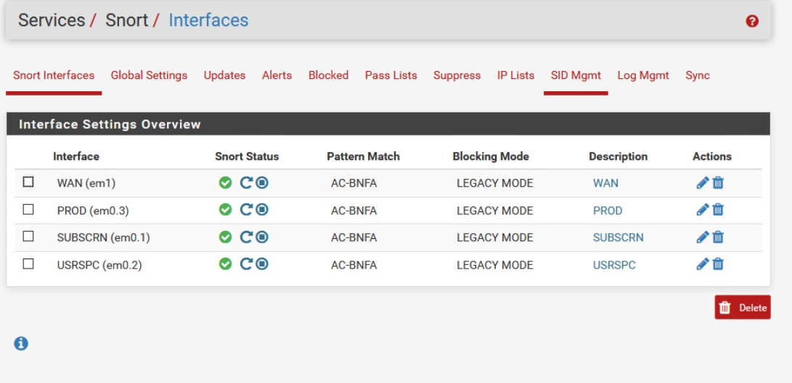
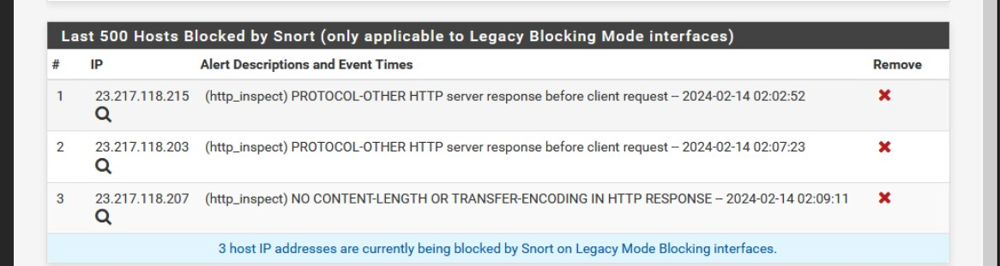
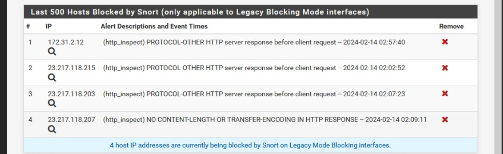
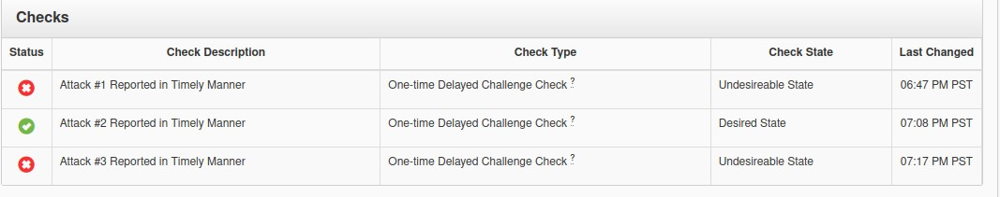

This is for the [NICE](https://nice-challenge.com/) challenge. This challenge was significantly harder than the previous challenges, involving being attacked in realtime, and having to write up incident response reports — and if you were too slow, you didn't get the points. 

This challenge involves doing an incident response, after an active cyberattack.

After some investigation, I find out that they have [snort](https://en.wikipedia.org/wiki/Snort_%28software%29) set up on their pfsense firewall:

This is my first time using snort, so everything below was figured out by web searches and browsing around the snort interface. 

However, it did not have any rules enabled by default. I checked a few boxes, and then clicked save to download the rules. After, that, I had to go to `Snort > Updates`, and explicitly tell it to update the ruleset.


In addition to that, snort did not have any interfaces added. I added all interfaces I thought would be relevant, WAN, PROD, SUBSCRN, and USRCRN, and started them: 




On the machines `Joomia` (Debian 9), which hosts the production server, and `Fileshare` (Ubuntu 16.04.3), I installed apache2 modsecurity, which is a simple web application firewall. 

`sudo apt install libapache2-modsecurity`

`sudo cp /etc/modsecurity/modsecurity.conf-recommended /etc/modsecurity.conf`

`sudo systemctl restart apache2`


# The Attacks



I made a mistake, and did not look at the options for packet capturing. I realized after the fact that pfsense/snort does not capture the relevant packets to inspect them by default.

That traffic probably isn't malicious, given how I did not receive any checks or failures for the 2 reports I submitted, but rather, only for the later traffic. 

# Nmap scan

On the other hand, there was a nmap scan, from `172.31.2.12` at the Prod-Joomia (172.16.10.100)

<details><summary>Show Log</summary>

```{.default}
[Wed Feb 14 02:30:07.709171 2024] [:error] [pid 1507] [client 172.31.2.12:34403] [client 172.31.2.12] ModSecurity: Warning. Matched phrase "nmap scripting engine" at REQUEST_HEADERS:User-Agent. [file "/usr/share/modsecurity-crs/rules/REQUEST-913-SCANNER-DETECTION.conf"] [line "59"] [id "913100"] [rev "2"] [msg "Found User-Agent associated with security scanner"] [data "Matched Data: nmap scripting engine found within REQUEST_HEADERS:User-Agent: Mozilla/5.0 (compatible; Nmap Scripting Engine; http://nmap.org/book/nse.html)"] [severity "CRITICAL"] [ver "OWASP_CRS/3.0.0"] [maturity "9"] [accuracy "9"] [tag "application-multi"] [tag "language-multi"] [tag "platform-multi"] [tag "attack-reputation-scanner"] [tag "OWASP_CRS/AUTOMATION/SECURITY_SCANNER"] [tag "WASCTC/WASC-21"] [tag "OWASP_TOP_10/A7"] [tag "PCI/6.5.10"] [hostname "172.31.2.2"] [uri "/"] [unique_id "Zcwlr38AAQEAAAXjvToAAAAA"]
```

</details>

However, I was too late in reporting this one, and this check was reported as late. 


# SSHD brute force

```{.default}
● ssh.service - OpenBSD Secure Shell server
   Loaded: loaded (/lib/systemd/system/ssh.service; enabled; vendor preset: enabled)
   Active: active (running) since Wed 2024-02-14 01:39:16 UTC; 1h 28min ago
 Main PID: 551 (sshd)
    Tasks: 1 (limit: 4915)
   CGroup: /system.slice/ssh.service
           └─551 /usr/sbin/sshd -D

Feb 14 02:49:43 Prod-Joomla sshd[1792]: Failed password for jcortes from 172.31.2.12 port 38181 ssh2
Feb 14 02:49:43 Prod-Joomla sshd[1792]: Connection closed by 172.31.2.12 port 38181 [preauth]
Feb 14 02:49:43 Prod-Joomla sshd[1794]: pam_unix(sshd:auth): authentication failure; logname= uid=0 euid=0 tty=ssh ruser= rhost=172.31.2.12  user=jcortes
Feb 14 02:49:44 Prod-Joomla sshd[1794]: Failed password for jcortes from 172.31.2.12 port 39276 ssh2
Feb 14 02:49:44 Prod-Joomla sshd[1794]: Connection closed by 172.31.2.12 port 39276 [preauth]
Feb 14 02:49:45 Prod-Joomla sshd[1796]: pam_unix(sshd:auth): authentication failure; logname= uid=0 euid=0 tty=ssh ruser= rhost=172.31.2.12  user=jcortes
Feb 14 02:49:47 Prod-Joomla sshd[1796]: Failed password for jcortes from 172.31.2.12 port 40027 ssh2
Feb 14 02:49:47 Prod-Joomla sshd[1796]: Connection closed by 172.31.2.12 port 40027 [preauth]
Feb 14 02:49:47 Prod-Joomla sshd[1798]: Accepted password for jcortes from 172.31.2.12 port 46478 ssh2
Feb 14 02:49:47 Prod-Joomla sshd[1798]: pam_unix(sshd:session): session opened for user jcortes by (uid=0)
```

And these were only the recent logs. Going through `journalctl -xeu ssh`, there were a LOT more attempts. 

I got lucky though, as the attacker didn't stay in for long:



It seems that snort detected and blocked 172.31.2.12 (the default config also kills existing connections), detecting the brute force. In the future, I need to spend less time trying to figure out snort, and more time setting up fail2ban to avoid ssh brute forces.


# Attack 3 — Out of time


I ran out of time:



I couldn't figure out what it was, either.

