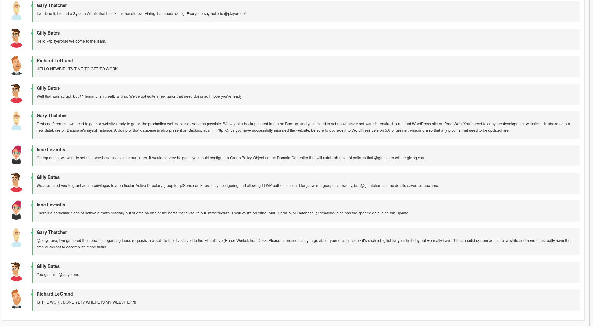

This is for the [NICE](https://nice-challenge.com/) challenge.

I did pretty poorly with this one. I have little to no hands-on experience with pfsense and Windows Active Directory.


Same as before, there was a simulated chatroomm:




However, there were yet more notes, as mentioned in the simulated chatroom:

```{.defualt}
Create Active Directory security group named DasNetworkAdmins with Gary Thatcher, Brimlock Stones, and yourself as members. Grant members of DasNetworkAdmins the privileges required to sign in to pfSense (Firewall) and make changes on all pages as admins.

For the pfSense LDAP authentication, I have created a bind user for you on the domain. The credentials are 'pfSenseBind' with the password 'password123'. The system for getting that setup works much better in new versions of pfSense, so you should do that first.

Please create a new database called production_site and create the user das_user for the website to connect with using the backup located at /ftp on Backup.
das_user only needs to have privilege on that database, since we're trying to keep a least privilege model.

Please patch shellshock on Fileshare

For the Domain Group Policy we are making for the new security group, DasNetworkAdmins, please:

Name it Network-Policy
Please ensure that the Computers Security Setting Account Password Policy is set to not allow passwords to be shorter than 14 characters.

Please enable the Computers Security Setting Local Policy for Auditing Policy Changes on both successes and failures.
    

Please enable the Computers Security Setting Local Policy Security Option to limit the amount of cached previous logons to 0.
    

Then make sure to apply and enforce the new GPO.

Make sure that after migrating the website to the production server that it is all accessible at www.daswebs.com.

DO NOT CHANGE ANY PASSWORDS
```

(I used [xkcd949.com](https://xkcd949.com) to send the file to a remote machine, since the Windows command line was not cooperative.)

And here are the checks:


# Database

I need to start by importing the relevant database from `/ftp/wordpress.sql`, on the Debian 9 "Backup" machine, onto the database on the Windows "Database" machine

An easy way to do that is via the builtin `python3 -m http.server` command with `/ftp` as my working directory. I can then simply download the file from `172.16.30.79:8000/wordpress.sql` using the Firefox browser on windows. 


Then, I can simply [import an sql database using the mysql command line](https://www.digitalocean.com/community/tutorials/how-to-import-and-export-databases-in-mysql-or-mariadb#step-2-mdash-importing-a-mysql-or-mariadb-database)

I also need to [create a user](https://www.digitalocean.com/community/tutorials/how-to-create-a-new-user-and-grant-permissions-in-mysql)

```{.default}
mysql -u root

CREATE DATABASE production_database;

CREATE USER 'das_user'@'*' IDENTIFIED BY password 'das_password';

GRANT ALL PRIVILEGES ON production_database.* TO 'das_user'@'*';

exit
```

And then in the normal shell:

```{.default}
bash # this is important or else < redirect will not work

mysql -u root -p production_site < C:\\Users\playerone.DASWEBS\Downloads\wordpress.sql
```

However, despite all of this, the check still isn't green. 


# Fileshare

I was tasked with patching [Shellshock](https://en.wikipedia.org/wiki/Shellshock_(software_bug)) this machine. "Fileshare" was a Debian 10 machine, which is still receiving [minimal LTS support](https://endoflife.date/debian), meaning all I have to do to patch this bug is to upgrade the packages. 

```{.default}

sudo apt update

sudo apt upgrade
```

This errored, it recommended running with `--fix-missing`, and so I did.

```{.default}
sudo apt upgrade --fix-missing
```

After this, the "Shellshock" check was green.

# Domain-Admin

To change group policy on the Windows Domain Controller ...


# Firewall

[Here the docs on connecting pfsense to ldap](https://docs.netgate.com/pfsense/en/latest/usermanager/ldap.html)


# Prod-Web

To install the "required web server software" (Apache), was simple

```{.default}
sudo yum install httpd
```

However, the relevant check does not become green. 


