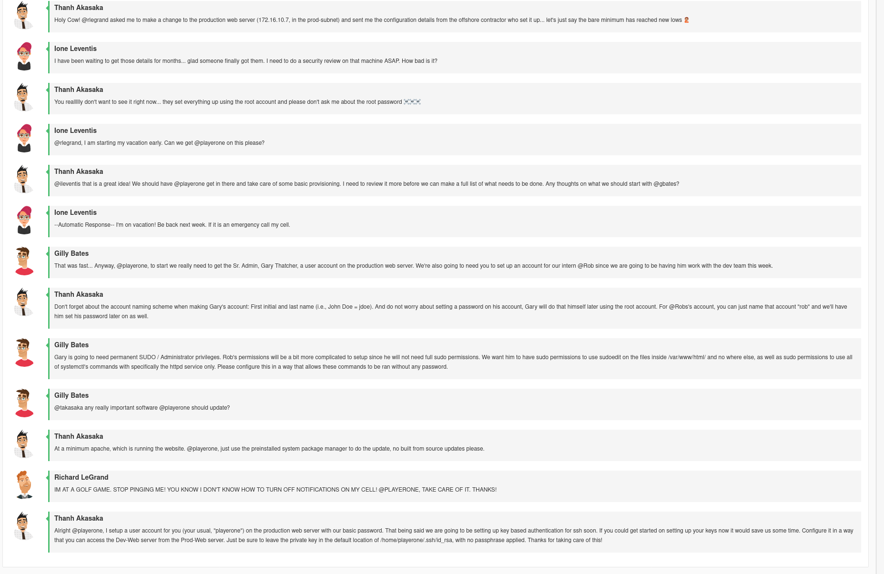
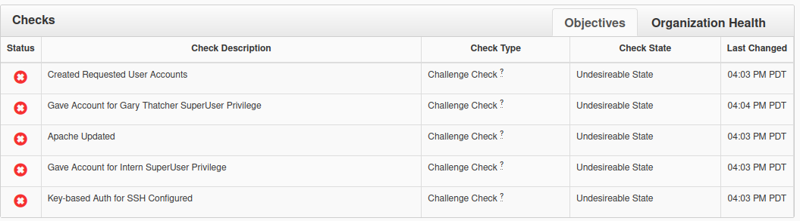
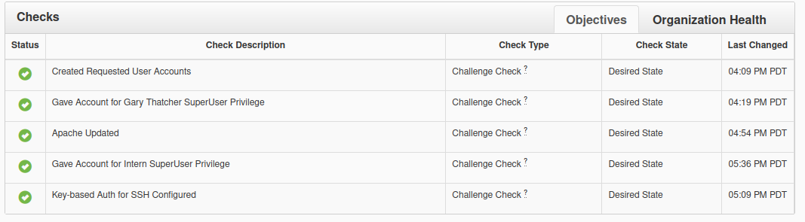

This is for the [NICE](https://nice-challenge.com/) challenge, and this would be my fifth one (not counting repeats). 


As usual, it started out with a simulated chatroom:



And, there were also some empty checks. 



Based on this, it seems like I will be working on the "Production Web Server", primarily.

# Prod-Web

## Users

First, I created user accounts for the relevant users. 

```{.default}
useradd gthatcher

useradd rob
```

Since `gthatcher` is going to be an admin, I added them to the `wheel` user group, since that is often used as an administrator group on Linux systems. 

`usermod -aG wheel gthatcher`

Then, I used the `visudo` command to edit the sudoer's file and add wheel as a group that could use all commands with sudo:

```{.default filename='/etc/sudoers'}
## Allows people in group wheel to run all commands
%wheel	ALL=(ALL)	ALL
```

The other thing I added was for user `rob` to be able to run certain commands as sudo, without a password, but only those commands. 

```{.default filename='/etc/sudoers'}
rob ALL=NOPASSWD : /bin/sudoedit /var/www/html/*, /bin/systemctl status httpd, /bin/systemctl stop httpd, /bin/systemctl start httpd, /bin/systemctl restart httpd, /bin/systemctl enable httpd, /bin/systemctl disable httpd
```


## Update Apache

Also, I needed to update apache. However, the repos completely broken on this machine, so I deleted them, and made way for new repos. 

```{.default}
mv /etc/yum.repos.d /etc/yum.repos.bac # Back up old yum repos just in case

mkdir /etc/yum.repos.d

curl http://mirror.centos.org/centos/7/atomic/x86_64/repo/CentOS-Base.repo -o /etc/yum.repos.d/CentOS-Base.repo

yum update
```

And with this, Apache is updated. 

## Ssh Config

Ssh needs to be configured to use key based authentication, instead of password based authentication. 

On the Prod-Web server:

```{.default}
ssh-keygen # this generates an ssh key in the default location. I did not set a passphrase.

scp .ssh/id_rsa.pub playerone@172.16.20.11:/home/playerone/.ssh/authorized_keys # use password to authenticate the connection
```

This creates a key and authorizes it for use on the Dev-Web server. 

And with this, all checks are green:




