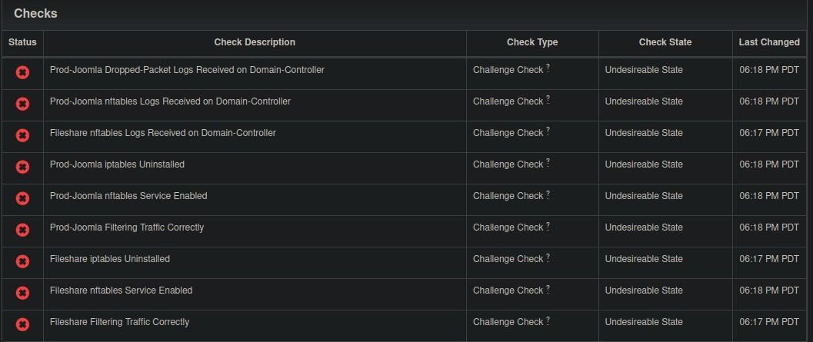
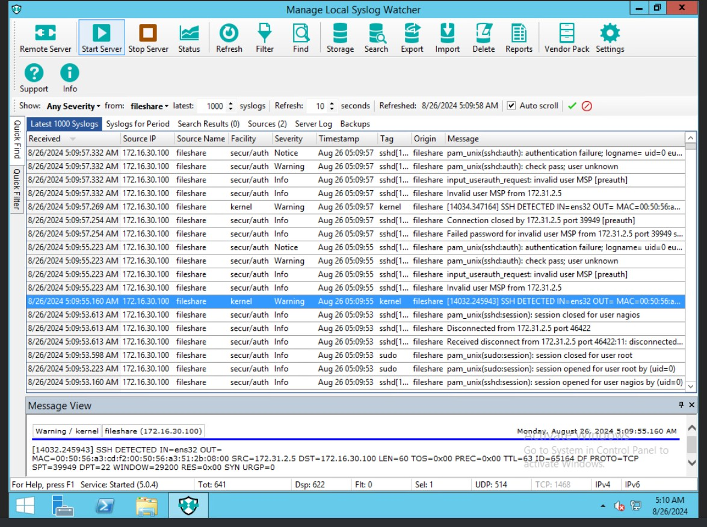

This is for the [NICE](https://nice-challenge.com/) challenge. It's a blue team challenge where you are tasked with hardening machines. Perhaps there is more, but all I was asked to do for this challenge was some simple hardening. 

The name of this specific challenge was "CCDC Training 1 - Firewall Updates at Pretty Safe Electronics Corp.". The point of this challenge was to convert multiple older Linux machines from iptables to nftables. 

Like previous Nice challenges, this challenge also began with a simulated chatroom, where we the situation was explained. 


Here are the empty checks:



# Fileshare

## Nftables Migration

::: {.callout-tip}
Use the `pastebinit` command, provided by the `pastebinit` package to easily upload files to pastebins, online sites dedicated to sharing short bits of text. 

`command | pastebin -b paste.debian.net` uploads to <paste.debian.net>, or use the `-i` argument to upload a specific file.
:::

In the home directory, there is a file that contains the iptables rules:

```{.default filename='fs_iptables_v4'}
# Generated by iptables-save v1.6.0 on Thu Jan 17 04:11:15 2019
*filter
:INPUT DROP [0:0]
:FORWARD ACCEPT [0:0]
:OUTPUT ACCEPT [41:8202]
-A INPUT -m conntrack --ctstate RELATED,ESTABLISHED -j ACCEPT
-A INPUT -p tcp -m tcp --dport 22 -j ACCEPT
-A INPUT -p tcp -m tcp --dport 139 -j ACCEPT
-A INPUT -p tcp -m tcp --dport 445 -j ACCEPT
COMMIT
# Completed on Thu Jan 17 04:11:15 2019
```

Except... not quite. When using iptables -L or iptables-save to look at the rules, they give different results than the saved file, a few less:


```{.default}
Chain INPUT (policy DROP)
target     prot opt source               destination         
ACCEPT     all  --  anywhere             anywhere             ctstate RELATED,ESTABLISHED
ACCEPT     tcp  --  anywhere             anywhere             tcp dpt:ssh
ACCEPT     tcp  --  anywhere             anywhere             tcp dpt:microsoft-ds

Chain FORWARD (policy ACCEPT)
target     prot opt source               destination         

Chain OUTPUT (policy ACCEPT)
target     prot opt source               destination         
```

```{.default filename='iptables-save'}
# Generated by iptables-save v1.6.0 on Mon Aug 26 01:26:17 2024
*filter
:INPUT DROP [31:3283]
:FORWARD ACCEPT [0:0]
:OUTPUT ACCEPT [2070:673014]
-A INPUT -m conntrack --ctstate RELATED,ESTABLISHED -j ACCEPT
-A INPUT -p tcp -m tcp --dport 22 -j ACCEPT
-A INPUT -p tcp -m tcp --dport 445 -j ACCEPT
COMMIT
# Completed on Mon Aug 26 01:26:17 2024
```

Because the file in the home directory has extra iptables configuration, I will use those configurations instead. Despite being the output of `iptable-save`, I can use the `iptables-nftables-compat` package, which provides and `iptables`   and `iptables-save` command that actually manipulate `nftables`. 

So, because only the `INPUT` chain has rules, and none of the other chains have any rules (including `mangle` or `nat`), we only need to flush those rules:

`iptables -F INPUT`

The other thing that needs to be done is to change the iptables `INPUT` table to from teh default `DROP` policy to an `ACCEPT` policy.

`iptables -P INPUT ACCEPT`

after this, iptables is clear of rules:

```{.default}
Chain INPUT (policy ACCEPT)
target     prot opt source               destination         

Chain FORWARD (policy ACCEPT)
target     prot opt source               destination         

Chain OUTPUT (policy ACCEPT)
target     prot opt source               destination
```

Now, with the iptables chains set to the default, and the ruleset saved, we can comfortable switch to nftables. The `iptables-compat` set of commands, provided by the `iptables-nftables-compat` package, lets us restore the ruleset to nft from the firewall:

`iptables-compat-restore fs_tables_v4` ­— this passes the "Fileshare filtering traffic correctly check.

`systemctl enable nftables`

`systemctl start nftables.service` 

And... no checks passed? It seems that enabling the nftables service resets the nftables rules. 

```{.default filename='/lib/systemd/system/nftables.service'}
[Unit]
Description=nftables
Documentation=man:nft(8) http://wiki.nftables.org

[Service]
Type=oneshot
RemainAfterExit=yes
StandardInput=null
ProtectSystem=full
ProtectHome=true
ExecStart=/usr/sbin/nft -f /etc/nftables.conf
ExecReload=/usr/sbin/nft -f /etc/nftables.conf
ExecStop=/usr/sbin/nft flush ruleset

[Install]
WantedBy=multi-user.target
```

The systemd nftables service seems to be a oneshot service that does nothing but flush the nftables rules. After disabling this service and using `iptables-compat-restore`, again, the "Fileshare filtering" check passes again. 

After `apt remove iptables`, this removes `iptables`... and `iptables-nftables-compat`. But the "Fileshare remove iptables" check passes. 

## Firewall Logging

What needs to be logged:

* Log all SSH connection attempts with a prefix of "SSH DETECTED"

```{.default}
iptables-compat -N SSH # Create new chain for SSH

iptables-compat -D INPUT -j ACCEPT -p tcp --dport 22 # delete the existing ssh rule

iptables-compat -A INPUT -j SSH -p tcp --dport 22 # Create new ssh rule that targets ssh chain instead

iptables-compat -A SSH -m limit --limit 5/min -j LOG --log-prefix "SSH DETECTED " --log-level 4

iptables-compat -A SSH -j ACCEPT

```

This works, and logs are reported in syslog, and forwarded to the domain controller machine. It just does not pass the check. 

# Prod-Joomia

## Nftables migration

Follow steps for the machine "Fileshare".

## Firewall logging

Follow steps for "Fileshare" machine.

```{.default}
iptables-compat -N DROPLOG

iptables-compat -P INPUT ACCEPT # Accepts all input packets

iptables-compat -A INPUT -j DROPLOG # if this is the last rule in the chain, then any packets that don't match previous rules are subject to this one instead.

iptables-compats -A DROPLOG --m limit -limit 5/min -j LOG --log-prefix "PACKET DROPPED " --log-level 4

iptables-compat -A DROPLOG -j DROP # If this is the last rule in the "DROPLOG" chain, then packets which don't match this rule will match this instead

```

# Domain-Controller

On the desktop, there is program to install "Syslog" watcher. Follow the prompts. Install both the service, and the manager. Make sure to select the option to open the firewall port as well.



It seems to be detecting syslog connections with ssh, but I'm not getting the points. It does say "SSH DETECTED" logged from the Fileshare machine.


